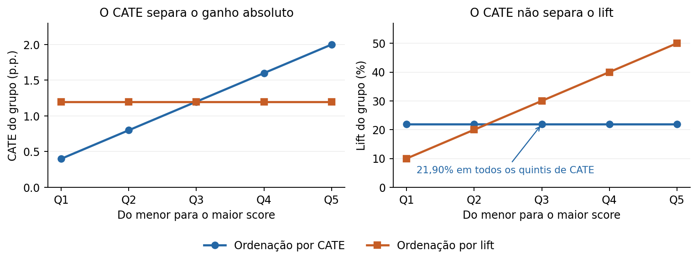

# relative-dml

Pacote Python inicial para **outcome binário** e efeitos relativos com tratamento discreto ou contínuo. Implementa o Q-Learner discreto, uma construção Q contínua por classificação e estimadores com cross-fitting. Reaproveita o momento multiplicativo do manuscrito em `continuous_q_paper`.

[Paper em PDF](continuous_q_paper/paper.pdf) · [Código dos exemplos por quintil](continuous_q_paper/quantile_examples.py)

**Convenção:** `T` representa o tratamento, `t` seu valor e `t0` o valor de referência: `ratio = P(Y(t)=1 | X) / P(Y(t0)=1 | X)` e `lift = ratio - 1`. Um lift de `0.20` significa aumento relativo de 20%; não significa 20 pontos percentuais. Todas as previsões retornam um vetor por indivíduo. Não são probabilidades individuais de benefício.

## Instalação local

Na raiz deste projeto, em PowerShell:

```powershell
python -m venv .venv
.\.venv\Scripts\python.exe -m pip install -e ".[paper,test]"
.\.venv\Scripts\python.exe examples/quickstart.py
.\.venv\Scripts\python.exe -m pytest -q
```

Python >= 3.9; dependências do pacote: NumPy, SciPy e scikit-learn. pandas e matplotlib são usados apenas nos experimentos. A instalação é local; o pacote não foi publicado no PyPI. `pyproject.toml` contém os metadados para instalação e geração de wheel.

## Escolha inicial

| Classe | Tratamento | O que estima / hipótese adicional |
|---|---|---|
| `DiscreteQLearner` | Dois ou mais braços | Identidade Q por duas classificações de braço; sem garantia DR |
| `DiscreteDML` | Dois ou mais braços | Médias AIPW de cada braço, aprendidas por regressão; razão das médias estimadas |
| `ContinuousQLearner` | Dose numérica | Classificação de conversores versus população completa; contraste flexível, sem garantia DR |
| `ContinuousDML` | Dose numérica | Momento multiplicativo sob log-resposta relativa linear na dose e nos modificadores escolhidos |

Para começar no caso contínuo, use `ContinuousDML` se uma inclinação relativa constante na janela de dose for plausível. Compare com `ContinuousQLearner` e uma regressão de outcome. A classificação Q contínua é próxima de um S-learner e **não** pressupõe superioridade sobre ele. Curvatura omitida pode enviesar o DML mesmo com nuisances corretas.

## Tratamento contínuo

```python
from relative_dml import ContinuousDML

# X: matriz numérica (n, p), com confundidores anteriores ao tratamento.
# t: vetor da dose; y: vetor com 0/1.
# V deve conter modificadores pré-especificados, derivados de X, sem intercepto.
V = X[:, :1]
model = ContinuousDML(n_splits=3, reference_dose=0, random_state=42)
model.fit(X, t, y, effect_features=V)

ratio = model.predict_ratio(X_new, treatment=0.5, reference=0,
                            effect_features=X_new[:, :1])
lift = model.predict_lift(X_new, treatment=0.5, reference=0,
                          effect_features=X_new[:, :1])
slope = model.predict_slope(X_new, effect_features=X_new[:, :1])
print(model.coef_, model.se_)
```

O modelo é `mu(t,x) = b(x) * exp((t-reference_dose) * [1,V(x)] @ coef_)`. O intercepto do **efeito** é adicionado automaticamente. Sem `effect_features`, o ajuste tem apenas uma inclinação relativa comum. O conjunto completo de confundidores continua em `X`. Use as mesmas transformações e ordem das colunas em treino e previsão.

`treatment` e `reference` podem ser escalares ou vetores de tamanho igual ao número de linhas. `reference_dose` é a referência escalar usada para treinar a nuisance de baseline; as doses comparadas em previsão podem ser outras. As doses são verificadas contra o intervalo global observado, mas isso **não verifica suporte condicional** em cada perfil.

`predict_slope` é a derivada de **log-risco**, por unidade de `t`. É elasticidade em relação ao preço somente quando `t` é log-preço ou log-variação de preço. Padronizações adicionais mudam a unidade.

As nuisances são treinadas em três folds por padrão, usando histogram gradient boosting. É possível passar `outcome_model` (classificador com `predict_proba`) e `treatment_model` (regressor com `predict`), compatíveis com `sklearn.base.clone`. `baseline_oof_`, `treatment_mean_oof_`, `fold_ids_` e `estimate_` permitem inspecionar o ajuste. `se_` fornece o sandwich i.i.d. do manuscrito, sob a interseção e taxas DML; não há intervalos automaticamente válidos sob misspecificação persistente de nuisance.

O wrapper implementa apenas a base linear na dose. A discussão teórica de splines e intervenções estocásticas no paper não significa que essas extensões estejam implementadas na API.

## Tratamento discreto

```python
from relative_dml import DiscreteQLearner, DiscreteDML

# t contém rótulos de braços, incluindo strings; não são doses interpoladas.
model = DiscreteDML(random_state=42).fit(X, t, y)
lift = model.predict_lift(X_new, treatment="oferta", reference="controle")
mu_control = model.predict_response(X_new, treatment="controle")

q = DiscreteQLearner(random_state=42).fit(X, t, y)
q_lift = q.predict_lift(X_new, treatment="oferta", reference="controle")
```

O Q estima `q(t|x)=P(T=t|X=x,Y=1)` e `e(t|x)=P(T=t|X=x)`, e retorna `(q_t/e_t)/(q_ref/e_ref)`. É a identidade multiclasses do [artigo motivador](https://arxiv.org/html/2605.26288v1).

O DML constrói, fora do fold, `Z_t = mu_t + 1(T=t)*(Y-mu_t)/e_t`, regressa cada `Z_t` em `X` e forma a razão das previsões. **Não divide pseudo-outcomes individuais nem os corta em zero.** A dupla robustez das médias exige propensão correta ou os respectivos outcomes corretos; a razão também exige regressões finais consistentes e denominador positivo. Não se fornece inferência pontual para a função condicional.

Os argumentos `propensity_model`, `outcome_model`, `final_model` e `converter_model` permitem substituir os modelos relevantes em cada classe. Modelos probabilísticos devem manter probabilidades calibradas: balanceamento arbitrário de classes muda a identidade Q ou os pesos AIPW. `DiscreteDML` exige ao menos `n_splits` conversões e não conversões por braço. `DiscreteQLearner` exige conversores em todos os braços.

`pseudo_outcomes_`, `fold_ids_` e `propensity_clip_fraction_` ficam disponíveis no DML. O piso `clip=0.001` estabiliza propensões; respostas finais são limitadas a `[clip,1]`. O código emite aviso quando aplica clipping. Um piso fixo pode introduzir viés onde o valor verdadeiro está abaixo dele; examine sensibilidade, denominadores e suporte.

O estágio final padrão usa boosting mais conservador: 30 iterações, taxa de aprendizagem 0,05, quatro folhas e pelo menos 200 registros por folha. Essa escolha foi feita após uma rodada piloto revelar instabilidade ao aplicar às médias AIPW o mesmo modelo das nuisances. A rodada original foi preservada; a avaliação principal utiliza novas sementes. A regularização não elimina toda a dificuldade de estimar ratios com poucos eventos.

## Q contínuo sem estimar duas densidades

```python
from relative_dml import ContinuousQLearner

q = ContinuousQLearner(random_state=42).fit(X, t, y)
lift = q.predict_lift(X_new, treatment=0.5, reference=0)
```

Treinamos um classificador de origem: classe 1 recebe `(X,T)` dos conversores; classe 0 recebe `(X,T)` da população completa. As duas origens têm o mesmo peso total. Pela identidade de Bayes, as odds da classificação são `mu(t,x)/P(Y=1)`, e a razão das odds em duas doses recupera o risk ratio. A referência conjunta preserva a alocação observada e o contraste mantém `X` fixo.

Conversores aparecem nas duas origens: essa duplicação não aumenta o número de observações independentes. Se fizer tuning, divida os **registros originais antes da duplicação**. O classificador customizado precisa aceitar `sample_weight`; o pacote clona o estimador antes de treinar. A identidade é não paramétrica, mas o desempenho depende da classe e regularização do classificador. Essa implementação não é o estimador de inclinação exponencial com densidade conhecida usado no primeiro Monte Carlo do paper.

## Pressupostos e limites

- Outcome binário, covariáveis numéricas finitas e dados i.i.d.; codifique categorias antes do ajuste. Não há tratamento de missing ou agrupamentos por cliente nesta versão.
- Interpretação causal exige consistência, ausência de confundimento não observado, covariáveis anteriores ao tratamento e overlap. Uma taxa com muitos valores marginais pode continuar tendo poucos braços condicionais.
- DML não corrige uma forma relativa incorreta. Razões positivas também não garantem que uma probabilidade absoluta extrapolada seja menor que um.
- A média de ratios individuais difere da razão das médias de conversão. Ranking por lift relativo e por ganho absoluto respondem a perguntas diferentes.
- Sem busca de hiperparâmetros, seleção automática de covariáveis, otimização de política ou inferência por clusters nesta versão.

## Experimentos e paper

```powershell
$env:OMP_NUM_THREADS="1"
.\.venv\Scripts\python.exe continuous_q_paper/scenario_experiments.py --reps 30 --n 12000 --test-n 2000
.\.venv\Scripts\python.exe continuous_q_paper/make_scenario_figures.py
```

São dez cenários com verdade conhecida, incluindo efeito nulo, comum, heterogêneo, conversão rara, pouco overlap, curvatura e múltiplos braços. Cada replicação usa amostra de teste independente. Os CSVs guardam métricas, sementes, falhas e avisos; `scenario_metadata.json` registra o ambiente efetivamente usado. As tabelas LaTeX são geradas dos CSVs.

A avaliação principal usa semente-base 20270906. O piloto anterior está em `continuous_q_paper/results/pilot` e pode ser reproduzido com `--seed 20260906 --pilot-final --out continuous_q_paper/results/pilot`. As duas rodadas usam os mesmos dez desenhos, com 30 replicações cada; somente o estágio final do DML discreto foi alterado após o piloto.

Os experimentos originais continuam em `continuous_q_paper/experiments.py`; a função `fit_multiplicative_dml` agora está no pacote e permanece importada naquele módulo. A API de baixo nível aceita nuisances externas fora da amostra ou pré-fixadas. Resultados antigos não foram substituídos pelo benchmark novo.

## CATE e lift: exemplos por quintil

O apêndice didático do paper usa probabilidades sintéticas conhecidas para separar duas perguntas: **quem gera mais conversões adicionais?** (score de CATE absoluto) e **quem apresenta maior aumento proporcional?** (score de lift). A mesma população é ordenada das duas formas e dividida em cinco grupos iguais, de Q1 (menor score) a Q5 (maior score).

As tabelas reportam conversão de referência, conversão sob tratamento, CATE em pontos percentuais, lift do grupo e conversões adicionais esperadas por mil oportunidades. O exemplo principal cruza cinco níveis de CATE com cinco níveis de lift, em 25 células de mesmo tamanho. **O CATE cresce de 0,4 a 2,0 p.p. entre seus quintis, mas o lift agregado permanece em 21,90% em todos.** Cada quintil contém a mesma distribuição de lifts individuais; o score relativo, por sua vez, separa lifts de 10% a 50%.

Um terceiro ranking usa a **propensão à conversão**, `P(Y=1 | X)`, sem ação/taxa como entrada. Ela é diferente da propensão a receber tratamento. Sob tratamento aleatório 50/50, esse score é `(mu0 + mu1)/2`, misturando baseline e efeito. Seus quintis têm CATE de 0,48; 1,12; 1,20; 1,52; 1,68 p.p., mas lifts de 35,64%; 42,21%; 30,00%; 24,52%; 12,73%: **o Q5 tem a maior conversão prevista e o menor lift**.



| Score usado para selecionar Q5 | Conversão-base | Conversão com ação | CATE | Lift do grupo |
|---|---|---|---|---|
| CATE | 9,13% | 11,13% | 2,00 p.p. | 21,90% |
| Lift | 2,40% | 3,60% | 1,20 p.p. | 50,00% |
| Conversão | 13,20% | 14,88% | 1,68 p.p. | 12,73% |

CATE e lift são efeitos **nos grupos escolhidos pelo score**. O classificador de conversão, isoladamente, não estima a mudança causada pela ação. Para a curva contínua do exemplo com dose aleatória uniforme em `[0,1]`, a propensão à conversão é `delta/log1p(lift)` e produz os mesmos quintis nesta população; em geral, ela depende da política histórica de doses.

Essa população foi construída para mostrar uma possibilidade, sem ruído de estimação: não implica independência geral entre CATE e lift nem superioridade de um algoritmo. Os complementos explicam empates com lift constante e por que a média individual de lift (30% nesse exemplo) difere do lift agregado. O exemplo anterior de rankings inversos continua disponível nos arquivos `quantile_profiles` e `quantile_rankings` e na figura `quantile_cate_vs_lift`; o novo exemplo usa o prefixo `quantile_flat`.

```powershell
python continuous_q_paper/quantile_examples.py
```

O comando recria os CSVs, tabelas LaTeX e gráficos do apêndice. Para recompilar o manuscrito, execute `pdflatex paper.tex` duas vezes dentro de `continuous_q_paper`, ou use Tectonic.
